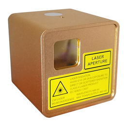

# G-CODE Generator
"G-CODE Generator" is a script to export data from Illustrator for laser engraving machine "cubiio". It can export "G-CODE" from Illustrator, and can accommodate large size such as A4 size.

[G-CODE Generator web site](https://www.inosyan.com/gcodegenerator)  
[cubiio web site](http://cubiio.muherz.com/index.html#header1-5x)  

  

----
This is the source code of G-CODE Generator.   
It is written in jsx which runs on Adobe Illustrator.  
This application consists of multiple classes. build.sh is used to pack them into one jsx file.  
